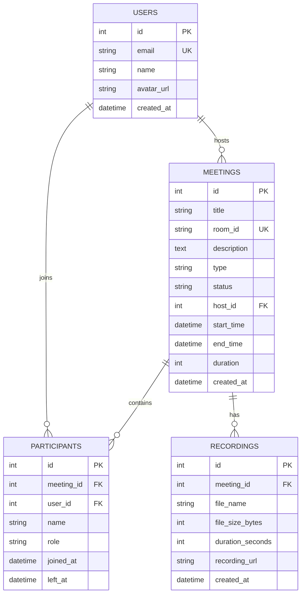

# Zoom Clone — Modern Web Video Conferencing Platform

A full-stack, production-grade clone of the Zoom Web Application that replicates Zoom’s design, user experience, and real-time meeting workflows. Built with **Next.js 14 (App Router)**, **FastAPI (Python)**, **SQLAlchemy**, and native **Browser WebRTC & WebSocket Synchronization**.

---

## 🌐 Live Deployments & Repository

| Service | Platform | Live URL |
| :--- | :--- | :--- |
| **Frontend Application** | Vercel | [https://zoom-clone-two-lilac.vercel.app](https://zoom-clone-two-lilac.vercel.app) |
| **Backend REST & WebSocket API** | Render | [https://zoom-clone-backend-uot2.onrender.com](https://zoom-clone-backend-uot2.onrender.com) |
| **Interactive API Documentation** | Swagger / OpenAPI | [https://zoom-clone-backend-uot2.onrender.com/docs](https://zoom-clone-backend-uot2.onrender.com/docs) |
| **GitHub Repository** | GitHub | [https://github.com/fli-09/zoom-clone](https://github.com/fli-09/zoom-clone) |

---

## 🚀 Core Features & Real-Time Functionality

### 1. Landing Dashboard
- **Pixel-Perfect Zoom Design**: Zoom blue theme (`#0E71EB`), dark card containers, live digital clock, and responsive navigation.
- **TopBar & Navigation**: Search bar, network security badge, and host profile placeholder.
- **Quick Action Tiles**:
  - 🟧 **New Meeting**: Instantly creates an instant meeting, auto-generates a unique room slug, and redirects to the room.
  - 🟦 **Join Meeting**: Allows joining via Meeting ID or full invite link with **real-time database existence validation**.
  - 🟦 **Schedule Meeting**: Modal with Title, Description, Date & Time picker, and Duration selector.
  - 🟦 **Share Screen**: Fast shortcut for screen presentations.
- **Upcoming Meetings**: Displays upcoming sessions fetched dynamically from `GET /api/meetings/upcoming` with "Start" and "Copy Invitation" buttons.
- **Recent Meetings**: Displays past or concluded sessions fetched from `GET /api/meetings/recent`.

### 2. Pre-Join Screen (Zoom Lobby)
- Before entering any meeting room, participants enter the **Zoom Pre-Meeting Lobby**:
  - Live local camera preview window.
  - Audio and video toggles (Mute/Unmute Mic, Start/Stop Video) to configure preferences prior to joining.
  - Prompt: **"Enter your display name"** (no hardcoded or pre-made fake names).
  - Clear **"Join Meeting"** action button.

### 3. Real-Time Multi-User Synchronization (FastAPI WebSockets)
- Synchronizes multiple attendees entering the same meeting room from different tabs, browsers, or devices:
  - **Dynamic Participant Count**: When User B joins via the invite link, User A's participant count instantly increases (1 ➔ 2 ➔ 3...), showing their actual chosen display name.
  - **Real-Time Group Chat**: Messages typed by any participant immediately broadcast to everyone in the room via WebSocket (`/ws/meeting/{room_id}`).
  - **Synchronized Floating Reactions**: When any participant sends a reaction (e.g. 🎉, 👍, ❤️, 👏, 🔥), the emoji floats up across all participants' screens.
  - **Host Controls**:
    - **Mute All**: Host can mute all attendee microphones simultaneously.
    - **Remove Participant**: Host can remove unwanted participants from the meeting stage.

### 4. Active Speaker Detection (Glowing Green Border)
- Powered by the browser's native **Web Audio API** (`AudioContext` and `AnalyserNode`):
  - Listens to the local microphone's volume levels in real time.
  - When a participant speaks above the audio threshold, an **emerald glowing border** automatically highlights their video tile and updates peer tiles over the WebSocket.

### 5. Live Media & Screen Sharing
- **Webcam & Mic Capture**: Uses `navigator.mediaDevices.getUserMedia` with robust callback refs to ensure streams remount cleanly when toggling video on/off.
- **Live Screen Sharing**: Uses `navigator.mediaDevices.getDisplayMedia` allowing users to broadcast windows, browser tabs, or entire displays directly into the meeting stage.

### 6. Meeting Recording Saved to Database
- When the host clicks **Record**:
  - Uses the browser's `MediaRecorder` API to capture meeting audio and video in high-quality `.webm` format.
  - When **Stop Recording** is clicked:
    1. Triggers an automatic local video file download (`meeting-[roomId]-[timestamp].webm`).
    2. Sends a `POST /api/meetings/{room_id}/recordings` request to persist the recording metadata (`file_name`, `duration_seconds`, `file_size_bytes`) into the database.

---

## 🛠️ Technical Stack

- **Frontend**: Next.js 14 (App Router, Single Page Experience), TypeScript, Tailwind CSS, Lucide React, Web Audio API, WebRTC Media APIs.
- **Backend**: Python 3.10+, FastAPI, WebSockets (`fastapi.WebSocket`), SQLAlchemy 2.0, Pydantic v2, Uvicorn.
- **Database**: SQLite (local development) / PostgreSQL (production cloud deployment on Render).

---

## 🗄️ Database Design & Schema

The database is structured and normalized using SQLAlchemy:



---

## 💻 Local Setup & Installation

### 1. Clone the Repository
```bash
git clone https://github.com/fli-09/zoom-clone.git
cd zoom-clone
```

### 2. Backend Setup
```bash
cd backend

# Create virtual environment
python -m venv venv

# Activate virtual environment
# Windows:
.\venv\Scripts\activate
# macOS/Linux:
source venv/bin/activate

# Install dependencies
pip install -r requirements.txt

# Start FastAPI server on port 8000
uvicorn app.main:app --reload --port 8000
```
> The API server will be live at `http://localhost:8000`.  
> Interactive Swagger docs: `http://localhost:8000/docs`.

### 3. Frontend Setup
```bash
cd frontend

# Install dependencies
npm install

# Create .env.local
echo NEXT_PUBLIC_API_URL=http://localhost:8000 > .env.local

# Start Next.js development server
npm run dev
```
> The application will be accessible at [http://localhost:3000](http://localhost:3000).

---

## 📌 Architecture & Design Decisions

1. **Pre-Join Name & Media Configuration**: Adheres directly to Zoom's user experience by requiring users to set their name and test their camera/mic prior to entering the meeting canvas.
2. **Real-Time WebSocket Architecture**: Lightweight, high-throughput WebSocket channel connects all clients in a room without third-party proprietary paid services, enabling cross-device participant counts, messaging, reactions, and speaking indicators.
3. **Audio Analyser for Active Speaker**: Avoids fake speaking animations by hooking Web Audio API frequency analysis to real microphone input.
4. **Resilient Video Streaming**: Uses React callback refs on HTML5 `<video>` elements to ensure media tracks remain bound even across video toggling, UI layout changes, or screen share switches.
