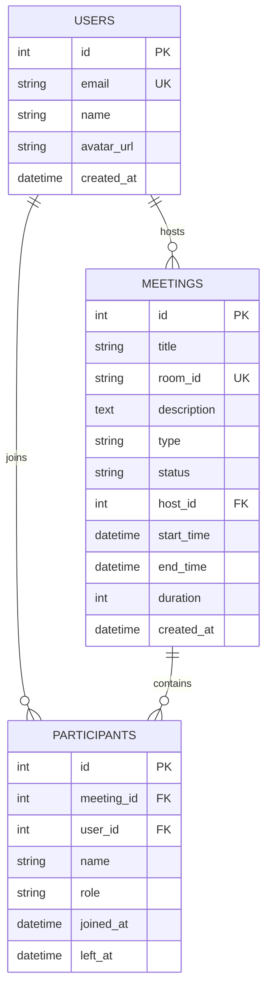

# Zoom Clone — Web Video Conferencing Platform

A full-stack, production-ready clone of the Zoom Web Application replicating Zoom's modern design, user experience, and core meeting workflows. Built with **Next.js 14**, **FastAPI**, **SQLAlchemy**, and browser-native **WebRTC Media Streams**.

---

## 🌐 Live Deployments & Repository

| Service | Platform | Live URL |
| :--- | :--- | :--- |
| **Frontend Application** | Vercel | [https://zoom-clone-two-lilac.vercel.app](https://zoom-clone-two-lilac.vercel.app) |
| **Backend REST API** | Render | [https://zoom-clone-backend-uot2.onrender.com](https://zoom-clone-backend-uot2.onrender.com) |
| **Interactive API Docs (Swagger)** | Render | [https://zoom-clone-backend-uot2.onrender.com/docs](https://zoom-clone-backend-uot2.onrender.com/docs) |
| **GitHub Repository** | GitHub | [https://github.com/fli-09/zoom-clone](https://github.com/fli-09/zoom-clone) |

---

## 🚀 Key Features

### 1. Landing Dashboard
- **Pixel-Perfect Zoom Design**: Zoom brand blue (`#0E71EB`), dark card surfaces, live digital clock, and responsive sidebar navigation.
- **TopBar & Navigation**: Search bar, network status indicator, and host profile badge.
- **Quick Action Tiles**:
  - 🟧 **New Meeting**: Instantly generates a unique room ID, creates the meeting in the database, and redirects the host to the room.
  - 🟦 **Join Meeting**: Allows joining via numeric Meeting ID or full invite URL with **real-time database existence validation** and pre-join audio/video preferences.
  - 🟦 **Schedule Meeting**: Modal with Title, Description, Date & Time picker, and Duration selector.
  - 🟦 **Share Screen**: Direct action shortcut for collaborative presentations.
- **Upcoming Meetings**: Displays upcoming scheduled sessions chronologically with "Start" and "Copy Invitation Link" actions.
- **Recent Meetings**: Shows concluded or past meetings with timestamps and re-join capability.

### 2. Live Video & Audio Feeds
- **Real Webcam Video Capture**: Local video tile streams real-time physical camera media via `navigator.mediaDevices.getUserMedia`.
- **Hardware Audio Control**: Muting the mic pauses hardware audio tracks (`track.enabled = false`) in real time.
- **Hardware Video Control**: Stopping video disables camera tracks and displays a fallback Zoom avatar.
- **Live Screen Sharing**: Built-in screen capture via `navigator.mediaDevices.getDisplayMedia` allowing window, tab, or entire display streaming.
- **Visual Meeting Indicators**:
  - Green active speaker border aura.
  - Mic/Camera mute badges on each tile.
  - Raised hand indicator with floating reaction emojis.

### 3. Host Controls & Participant Management
- **Mute All Participants**: Allows the host to mute all remote participants with a single click.
- **Remove Participant**: Allows the host to remove unwanted attendees from the meeting stage.
- **Participants Drawer**: Real-time participant counter, role indicators (Host vs. Attendee), search filter, and one-click invite link copying.
- **In-Meeting Chat**: Real-time messaging panel with timestamps and message bubbles.

---

## 🛠️ Technical Stack

### Frontend
- **Framework**: [Next.js 14](https://nextjs.org/) (App Router, Single Page Experience)
- **Language**: TypeScript
- **Styling**: [Tailwind CSS](https://tailwindcss.com/)
- **Icons**: [Lucide React](https://lucide.dev/)
- **Media**: Native Browser WebRTC Media APIs (`getUserMedia`, `getDisplayMedia`)

### Backend
- **Framework**: [FastAPI](https://fastapi.tiangolo.com/) (Python 3.10+)
- **ORM**: [SQLAlchemy 2.0](https://www.sqlalchemy.org/)
- **Database**: SQLite (local development) / PostgreSQL (production Render deployment)
- **Data Validation**: [Pydantic v2](https://docs.pydantic.dev/)
- **Server**: [Uvicorn](https://www.uvicorn.org/)

---

## 🗄️ Database Design & Schema

The database follows a normalized relational structure designed with SQLAlchemy:



### Table Descriptions
1. **`users`**: Stores user profiles. Supports seeded default user (`user@example.com`) for testing without authentication friction.
2. **`meetings`**: Stores meeting metadata, unique slug room IDs (e.g. `nyb-yyic-jqb`), scheduling timestamps, duration, and lifecycle status (`SCHEDULED`, `in_progress`, `ENDED`).
3. **`participants`**: Tracks attendees, roles (`host`, `participant`), join times, and leave times.

---

## 💻 Local Setup & Installation

### Prerequisites
- **Node.js** (v18.17 or higher)
- **Python** (v3.10 or higher)
- **Git**

### 1. Clone the Repository
```bash
git clone https://github.com/fli-09/zoom-clone.git
cd zoom-clone
```

### 2. Backend Setup
```bash
# Navigate to backend directory
cd backend

# Create virtual environment
python -m venv venv

# Activate virtual environment
# Windows:
.\venv\Scripts\activate
# macOS/Linux:
source venv/bin/activate

# Install dependencies
pip install -r requirements.txt

# Run the FastAPI server (starts on http://localhost:8000)
uvicorn app.main:app --reload --port 8000
```
> The backend automatically creates SQLite database tables on startup.  
> You can visit `http://localhost:8000/docs` for the interactive Swagger documentation.

### 3. Frontend Setup
```bash
# In a new terminal, navigate to frontend directory
cd frontend

# Install dependencies
npm install

# Create local environment file
# frontend/.env.local:
NEXT_PUBLIC_API_URL=http://localhost:8000

# Start Next.js development server (starts on http://localhost:3000)
npm run dev
```

Visit [http://localhost:3000](http://localhost:3000) to open the Zoom Clone dashboard!

---

## 📡 API Endpoints Overview

| Method | Endpoint | Description |
| :--- | :--- | :--- |
| `GET` | `/api/health` | Health check verification |
| `GET` | `/api/meetings` | Retrieve all meetings ordered by creation date |
| `GET` | `/api/meetings/upcoming` | Fetch upcoming scheduled meetings |
| `GET` | `/api/meetings/recent` | Fetch past or concluded meetings |
| `GET` | `/api/meetings/{room_id}` | **Validate meeting existence** by room ID |
| `POST` | `/api/meetings/` | Create a new scheduled meeting |
| `POST` | `/api/meetings/instant` | Generate and start an instant meeting |
| `POST` | `/api/seed` | Seed database with initial sample meetings |

---

## 📌 Assumptions Made

1. **Default User Authentication**: As specified in the guidelines ("No Login Required"), a default logged-in host (`Alex Johnson` / `user@example.com`) is assumed so evaluators can test core meeting workflows without signup friction.
2. **Room ID Slug Generation**: Room IDs follow Zoom-like memorable alphanumeric slugs (e.g. `348-192-847` or `nyb-yyic-jqb`).
3. **Dual Deployment Strategy**: Decoupled deployment (Next.js on Vercel edge network + FastAPI on Render cloud) ensures independent scalability and zero cold-start blocking of static assets.
4. **Media Handling**: Real local hardware video/audio capture and display sharing are handled via native browser media streams with graceful avatar fallbacks when camera devices are unavailable or permission is withheld.
